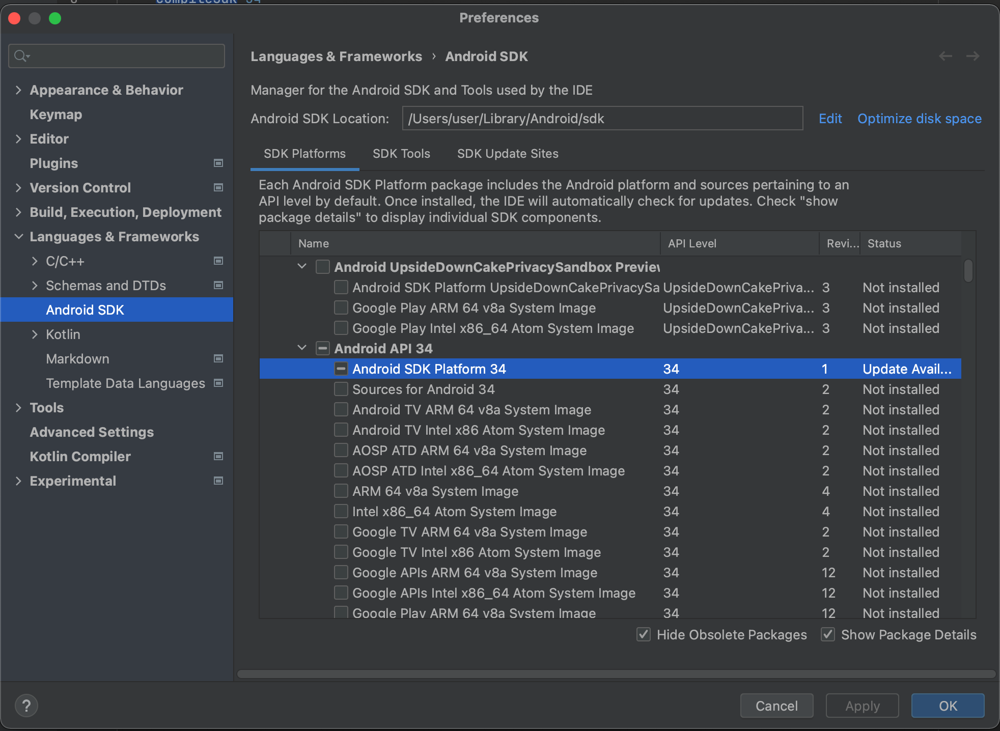
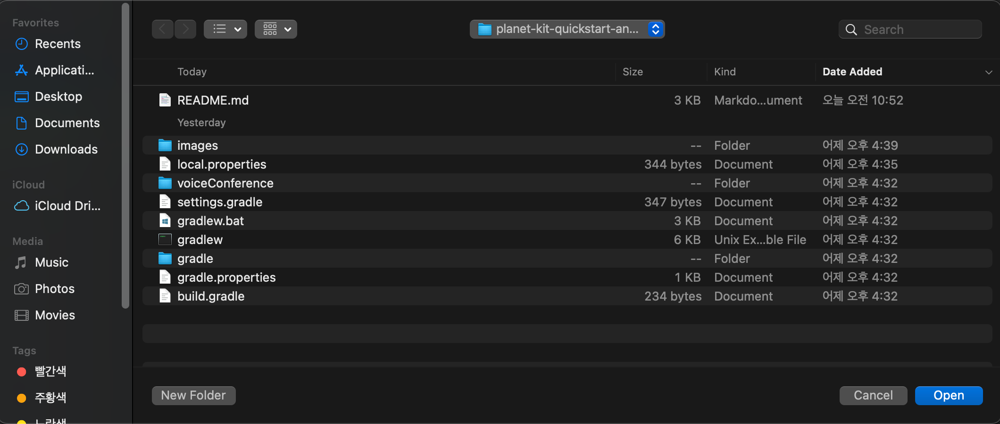
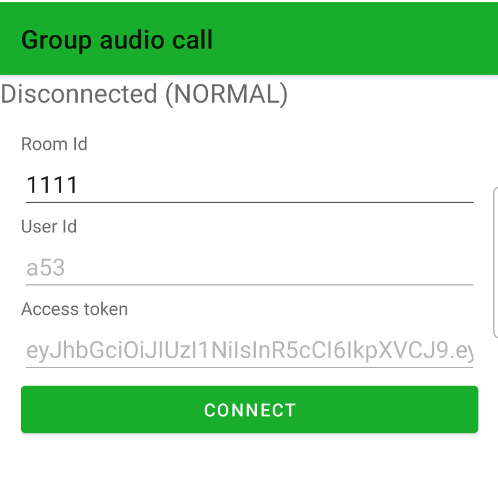
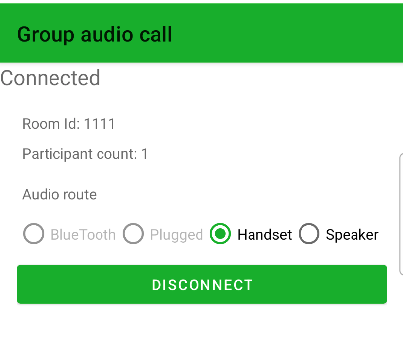
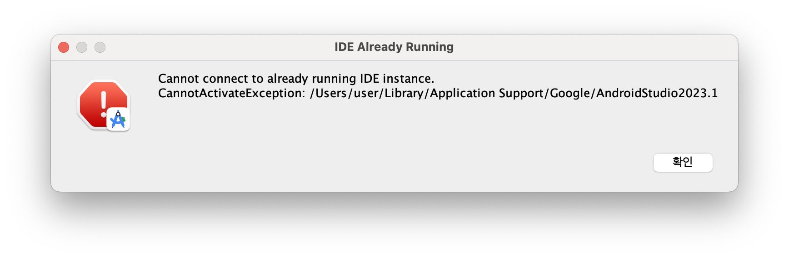
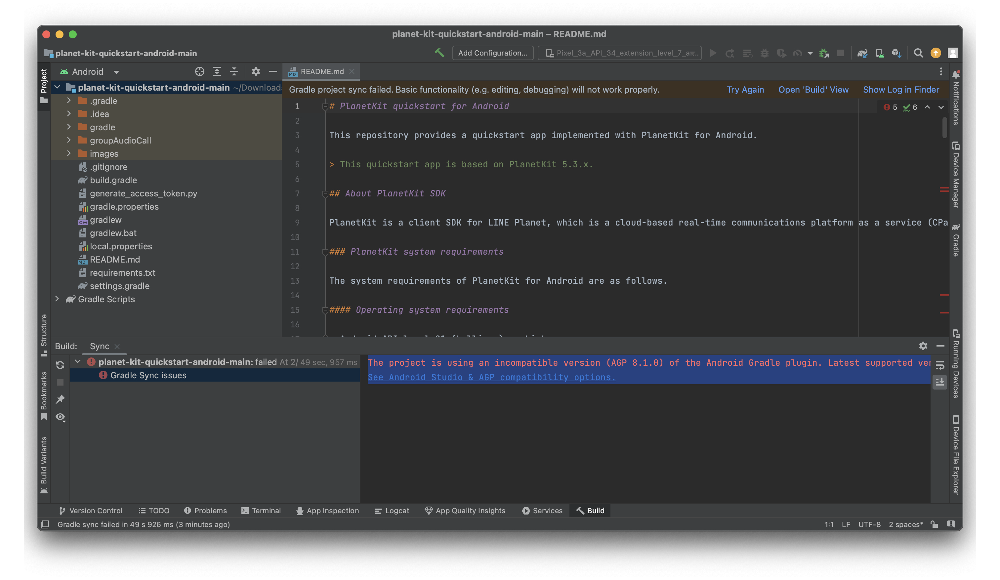

# PlanetKit quick start for Android

This repository provides a quick start project implemented with PlanetKit for Android.

> This quick start project is based on PlanetKit 5.4.x.

## About PlanetKit SDK

PlanetKit is a client SDK for LINE Planet, which is a cloud-based real-time communications platform as a service (CPaaS) that helps you build a voice and video call environment. With LINE Planet, you can integrate call features into your service at minimum cost.

### PlanetKit system requirements

The system requirements of PlanetKit for Android are as follows.

#### Operating system requirements

- Android API level 21 (Lollipop) or higher

#### App `targetSdkVersion` requirements

- `targetSdkVersion` 31 or higher

#### Java compatibility

- Java 8 or higher

#### Supported [ABIs](https://developer.android.com/ndk/guides/abis)

- armeabi-v7a
- arm64-v8a

#### Required runtime permissions

- `Manifest.permission.READ_PHONE_STATE`
- `Manifest.permission.RECORD_AUDIO`
- `Manifest.permission.CAMERA` (video call only)
- `Manifest.permission.BLUETOOTH_CONNECT` (`targetSdkVersion` 31 or higher only)

#### Foreground service types and notifications for microphone use in the background (Android 14)

- From Android 14 onwards, specifying foreground service types is required, especially for using the microphone in the background. For more information, see [Foreground service types are required](https://developer.android.com/about/versions/14/changes/fgs-types-required).
- This requirement must be applied at the application level, as it cannot be handled within the SDK.
- To ensure your foreground service works correctly, refer to the `NotificationService.kt` file and follow these steps:

##### 1. Starting the foreground service

To start a foreground service, use `startForegroundService()`. This method prepares the service to run in the foreground but does not actually start it.

```kotlin
val intent = Intent(this, MyForegroundService::class.java)
startForegroundService(intent)
```

##### 2. Specifying the foreground service type

Within the service, call `startForeground()`, passing the `Notification` and the appropriate foreground service type.
This step is necessary to indicate the type of operation the service is performing. For microphone usage, specify the `ServiceInfo.FOREGROUND_SERVICE_TYPE_MICROPHONE`.

```kotlin
class MyForegroundService : Service() {
    override fun onStartCommand(intent: Intent?, flags: Int, startId: Int): Int {
        val notification = createNotification()

        // Start the foreground service and specify the type for microphone usage
      if (Build.VERSION.SDK_INT >= Build.VERSION_CODES.R) {
        startForeground(
          NOTIFICATION_ID,
          notification,
          FOREGROUND_SERVICE_TYPE_MICROPHONE
        )
      }
      else if (Build.VERSION.SDK_INT >= Build.VERSION_CODES.Q) {
        startForeground(
          NOTIFICATION_ID,
          notification,
          FOREGROUND_SERVICE_TYPE_MEDIA_PLAYBACK
        )
      }
      else {
        startForeground(
          NOTIFICATION_ID,
          builder.build()
        )
      }
      return START_STICKY
    }
}
```

##### 3. Permissions for notifications

Starting from Android 13 (API level 33), you must request the `Manifest.permission.POST_NOTIFICATIONS` permission to send notifications.
Ensure this permission is included in your app's manifest and requested at runtime.

###### Manifest

```xml
<uses-permission android:name="android.permission.POST_NOTIFICATIONS"/>
```

###### Runtime request

```kotlin
if (Build.VERSION.SDK_INT >= Build.VERSION_CODES.TIRAMISU) {
    if (checkSelfPermission(Manifest.permission.POST_NOTIFICATIONS) != PackageManager.PERMISSION_GRANTED) {
        requestPermissions(arrayOf(Manifest.permission.POST_NOTIFICATIONS), REQUEST_CODE_POST_NOTIFICATIONS)
    }
}
```

### How to install the SDK

- [Installation](https://github.com/line/planet-kit-android?tab=readme-ov-file#installation)

### References

- [PlanetKit system requirements](https://docs.lineplanet.me/overview/specification/planetkit-system-requirements)
- [API Reference](https://docs.lineplanet.me/api-reference/client/android/5.4/index.html)

### Release information

- [API changelog](https://docs.lineplanet.me/android/reference/api-changelog)
- [Release notes](https://docs.lineplanet.me/android/reference/release-notes)

## Using the quick start project

This quick start project provides basic functionality of a **group audio call**.

### Prerequisites

- Android Studio
  - To build this quick start project, you need Android Studio. If Android Studio is not installed in your environment yet, [install Android Studio](https://developer.android.com/studio/install).

> To ensure compatibility and proper functionality, you must install Android Studio version Hedgehog or later to support API Level 34. For more information, see [Minimum versions of tools for Android API level](https://developer.android.com/build/releases/gradle-plugin#api-level-support).

- Android SDK Platform 34
  - The `targetSdkVersion` and `compileSdkVersion` of this quick start project is 34. So, the installation of Android SDK Platform 34 is required.
  - Open any folder in Android Studio and check the installation status of Android SDK Platform 34 as shown in the following screenshot (**Tools > SDK Manager**). If it is not installed yet, select "Android SDK Platform 34" and click **Apply** to proceed with the installation.

    
- Python 3.8 or higher
  - To generate an access token, you need [a supported version of Python 3.x](https://www.python.org/downloads/), currently 3.8 or higher.

### 1. Download source code

Clone this repository, or download this repository and unzip the files.

### 2. Open the project

In Android Studio, open the directory of the source code you downloaded. (**File > Open**)



### 3. Generate an access token

> In this quick start project, we provide a script that generates an access token for your convenience. However, during the actual implementation of your app, the access token must be created in the AppServer. For more information, refer to [Access token](https://docs.lineplanet.me/getting-started/essentials/access-token).

Generate an [access token](https://docs.lineplanet.me/overview/glossary#access-token) using `generate_access_token.py`.

- The script requires a valid user ID as an argument. For the naming restrictions of a user ID, see [User ID](https://docs.lineplanet.me/overview/glossary#user-id).
- Python package requirement for `generate_access_token.py` can be found in `requirements.txt`.
  - You can use the command `pip3 install -r requirements.txt` to install required packages.

> We recommend using a virtual environment for this step. For more information, see [how to use venv](https://packaging.python.org/en/latest/guides/installing-using-pip-and-virtual-environments/).

```bash
user@test planet-kit-quickstart-android % python3 generate_access_token.py <YOUR_USER_ID>
access token:  <GENERATED_ACCESS_TOKEN>
```

### 4. Apply the user ID and the access token

Copy and paste the user ID and access token into your code.

```kotlin
// Constants.kt
    const val USER_ID = "<YOUR_USER_ID>"
    const val ACCESS_TOKEN = "<GENERATED_ACCESS_TOKEN>"
```

### 5. Run the project

> Note: The microphone does not work on the Android emulator. Be sure to test your code on a real device.

Run the quick start project on an Android device.

### 6. Join a group audio call

Enter a room ID and click the **CONNECT** button.

> To join the call successfully, you need to enter a valid room ID. For the naming restrictions of a room ID, see [Room ID](https://docs.lineplanet.me/overview/glossary#room-id).



One you're connected to the call, you can communicate with other participants.



## Troubleshooting

### Android Studio Installation Error

If you encounter the following error during the Android installation on macOS, it may be because the owner of `~/Library/Application Support/Google` is `root`.



In such cases, try executing the following command and check again.

```bash
sudo chown $USER ~/Library/Application\ Support/Google
```

### Gradle sync issue related to Android Gradle plugin

If you encounter Gradle sync issues related to Android Gradle plugin (AGP) versions like the following screenshot, you must upgrade your Android Studio to version Hedgehog or later.



### Call connection issues

If the group call cannot be connected, please check [PlanetKitStartFailReason](https://docs.lineplanet.me/api-reference/client/android/5.4/planet/com.linecorp.planetkit/-planet-kit-start-fail-reason/index.html) and [PlanetKitDisconnectReason](https://docs.lineplanet.me/android/reference/disconnect-reason).

```kotlin
// check PlanetKitStartFailReason
// MainActivity.kt
...
val result = joinConference(roomId)
if (result.reason == PlanetKitStartFailReason.NONE) {
    mConference = result.conference
}
else {
    val message = "Failed: joinConference ${result.reason}"
    Log.e(Constants.LOG_TAG, message)
    Toast.makeText(this, message, Toast.LENGTH_LONG).show()
}
```

```kotlin
// check PlanetKitDisconnectReason
// MainActivity.kt
...
override fun onDisconnected(conference: PlanetKitConference, param: PlanetKitDisconnectedParam) {
    val message = "Disconnected (${param.reason})"
    Log.i(Constants.LOG_TAG, message)
}
```

## Issues and inquiries

Please file any issues or inquiries you have to our representative or [dl\_planet\_help@linecorp.com](mailto:dl_planet_help@linecorp.com). Your opinions are always welcome.

## FAQ

You can find answers to our frequently asked questions in the [FAQ](https://docs.lineplanet.me/help/faq) section.
